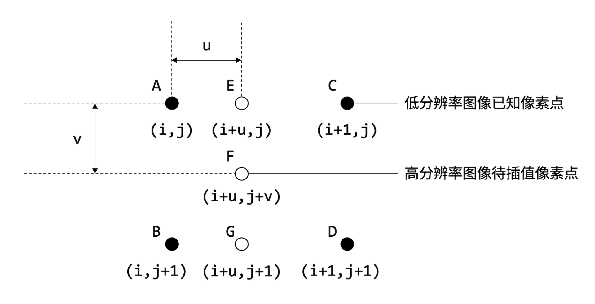

# ImageEnhance图像增强
## 项目介绍
> 通过命令行参数传入原始图像路径，生成图像途径，生成图片高度和宽度等参数，进行图像增强处理，包括：最邻近差值和双线性差值。

## 文件介绍

### getPath.py
- 实现通过调用fire库，以命令行参数传入原始图像路径，生成图像途径。
- 调用方式：
```python
import getPath
    path = getPath.path
```

### ImageAnalysis.py
- 调用getPath.py,opencv,numpy
- img_open返回图像形式的变量，img_array返回以像素点为单位存储的高维数组

### ImageEnhance.py
- 本项目的主题程序部分
- 添加了中文引导，通过键入1或2选择最邻近插值/双线性插值，放大/缩小，以及键入想要操作的倍数

#### 变量介绍
- algorithm 即选择的插值方法，用数字1、2表示
- solution 即上采样/下采样，用数字1、2表示
- multiple 即放大/缩小倍数，用整数表示
- img 原始图片的图像格式
- img_item 用于存储原始图片高与宽的字典
- img_array 以高维数组形式存储的原始图片


#### 算法实现方式以及部分修改及其原因进行解释
- 整体思路为
  - 计算出目标图片的尺寸
  - 根据尺寸使用np.zero()方法生成数组
  - 用双重for循环遍历数组
  - 将数组转换为图片并显示   
> 最邻近插值&上采样
- 除去本题的做法意外，不难想到使用scipy库中的ndimage方法
```python
from scipy import ndimage
def img_nearest_upsampling():
    global img, img_item, img_array, multiple
    img_n_u = ndimage.zoom(img_array, (multiple,multiple,1))
    img_n_u = np.array(img_n_u, dtype=np.uint8)
    cv2.imshow("img_nearest_upsampling", img_n_u)
    cv2.waitKey(0)
```
- 其中img_array为以高维数组形式存储到原始图像，multiple为放大倍数
- ***这种方法过于取巧，且与使用cv2.resize()并没有太大本质的区别，因此本项目还是通过操作数组来实现插值***

> 最邻近插值&下采样
- 同上，通过操作数组来实现插值
- 缩小图片时，考虑到了图片本身的像素行数能否整除缩小倍数，故对缩小后的图片尺寸用了不同表达式进行计算

> 双线性插值&上采样
- 根据算法定义，我们需要计算出附近4个已知点的像素的RGB值的加权平均数，故赋值时需要对待插值像素赋值三次，分别赋值RGB
- 
- 如图所示，项目中x_E，x_G即为图中所示

> 双线性插值&下采样
- 缩小图片时，考虑到了图片本身的像素行数能否整除缩小倍数，故对缩小后的图片尺寸用了不同表达式进行计算

## 运行方式
- 通过命令行打开ImageEnhance文件夹后
  - 输入 python ImageEnhance.py即可运行默认目录里的图片
  - 如需指定地址请键入 python ImageEnhance.py --trace=路径
  - 而后根据文字提示即可执行后续程序