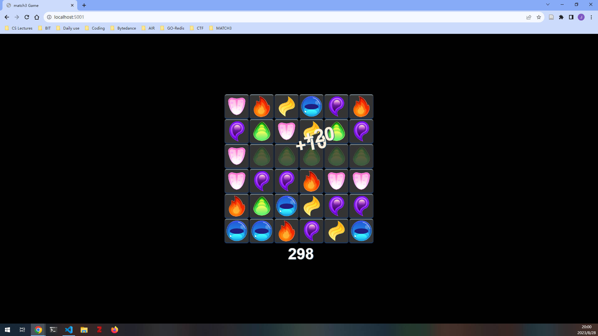

# 构建三消游戏

## 项目要求

### Project Introduction

In this project, we will be developing a Match 3 game using the PIXI.js library. The game will feature a board filled with colorful gemstones. The player's objective is to align three or more gemstones of the same color by swapping two adjacent gemstones, which will then eliminate them from the board. This project will provide a practical application of JavaScript and introduce the basics of game development, including the use of third-party libraries in a fun and engaging manner. The output of the game will be an interactive game board displayed on the screen, which updates in response to user inputs such as mouse clicks or keyboard inputs. To make the game more interesting and challenging, we will also introduce special gemstones with unique effects, time limits, and levels with different objectives.

### Implementation Approach

We will be using the PIXI.js library to create the game environment and handle the game logic. PIXI.js is a powerful 2D rendering library for the web, which makes it perfect for our Match 3 game. We will use JavaScript to implement the game logic, such as swapping gemstones, checking for matches, and refilling the board. We will also use JavaScript to create a simple scoring system. The game will follow a simple design pattern of a game loop, where the game continuously checks for user input, updates the game state, and renders the new game state to the screen. The input will be user interactions such as mouse clicks or keyboard inputs, and the output will be the updated game state displayed on the screen. To make the game more interesting and challenging, we will introduce special gemstones with unique effects, time limits, and levels with different objectives.

## 运行截图




## 使用说明

### 前置要求

1. 安装Node.js：Node.js是一个基于Chrome V8引擎的JavaScript运行时环境，用于在服务器端运行JavaScript代码。你可以从Node.js官方网站（https://nodejs.org ↗）下载并安装适合你操作系统的版本。选择LTS（长期支持）版本是一个稳定和可靠的选择。
2. 使用npm管理包：npm（Node Package Manager）是Node.js默认的软件包管理器，用于安装、管理和升级JavaScript包和依赖项。安装Node.js后，npm会自动随之安装。你可以使用npm来管理你的项目依赖项，以确保项目的正确性和一致性。

### 依赖

请通过以下命令安装依赖：

```bash
npm install
```

> 如依赖无法安装成功，请检查您的网络环境，必要时可换源处理。

### 运行

请通过以下命令运行：

```bash
npm run match3
```

如运行时发生报错，且报错与 `node_modules` 相关，请检查 `package.json` 中的 `scripts` 字段中 `match3` 项是否符合您的环境对路径的要求。

### 游戏方法

1. 鼠标左键单击选中某一方块，再次鼠标左键点击某一方块将取消选定。
2. 选定某一方块后，可点击其上下左右的方块进行交换，若交换后有三个或以上的方块连成一条线，则消除这些方块。
