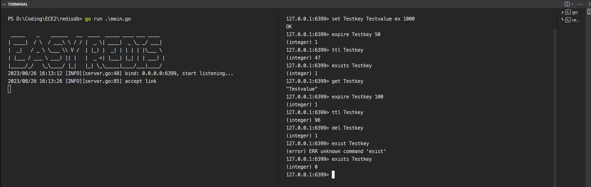

# 构建自己的 Redis

## 项目要求
> ### Project Introduction
> Welcome to this engaging programming project! We will be creating a simplified version of Redis, a widely used in-memory data structure store, using Golang. Our version will be capable of handling basic commands such as storing and retrieving key-value pairs, deleting key-value pairs, checking if a key exists, listing all keys in the database, and adding an expiration time to a key-value pair. This project will offer a fantastic opportunity to learn about databases, data structures, and time management in programming. The key-value pairs that can be stored in the database will be of string data type, and the expiration time will be represented in seconds. We will also provide detailed information on the input and output forms of the project, especially for the functions that store, retrieve, delete, and list key-value pairs.
> ### Implementation Approach
> We will be using the Singleton design pattern to ensure that only one instance of the database is used throughout the program. This will prevent data inconsistency and ensure that all operations are performed on the same database instance. We will also be using the time package in Golang to handle expiration times. The key-value pairs that can be stored in the database will be of string data type, and the expiration time will be represented in seconds. The functions will return appropriate messages or data based on the operation performed. We will also provide detailed information on the input and output forms of the functions.

## 运行截图




## 使用说明

### 前置要求

- 拥有Go语言编程环境。
- 安装Redis数据库：需要在计算机上安装Redis数据库。您可以从[Redis官方网站](https://redis.io)下载适用于您的操作系统的安装程序或源代码，并按照说明进行安装。


### 依赖

运行前，你需要先安装项目依赖，你可以使用以下命令安装依赖：

```bash
go mod download
```

你可以使用以下命令检查是否成功安装依赖：

```bash
go mod verify
```

### 运行

1. 使用命令行启动redisdb服务器：

```bash
go run ./main.go
```

2. 启动redis客户端，连接刚才运行的服务器：

```bash
redis-cli -p 6399
```

## 命令

命令行提供命令补全功能。

```bash
set key value [expiration EX seconds|PX milliseconds] [NX|XX] 设置key-value
e.g set Testkey Testvalue EX 10

del key 删除key
e.g. del Testkey

expire key seconds 设置过期时间
e.g expire Testkey 100

exists key 判断key是否存在
e.g. exists Testkey

ttl key 获取剩余时间
e.g. ttl Testkey

get key 获取key对应的value
e.g. get Testkey

keys * 获取所有key
e.g. keys *
```

大部分命令用法可参考[Redis官方文档](https://redis.io/commands)，由于本项目是一个简化版的Redis，所以不支持所有的命令。